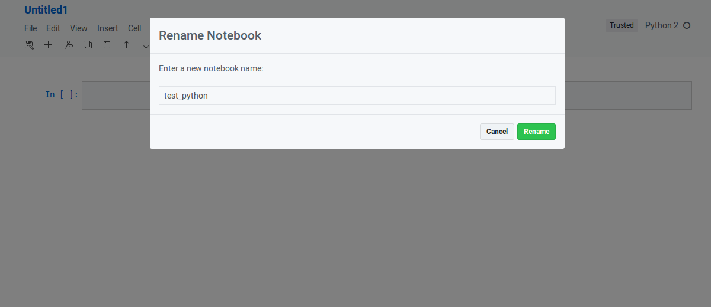
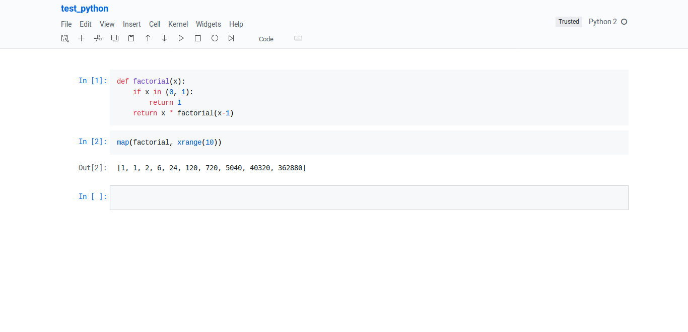
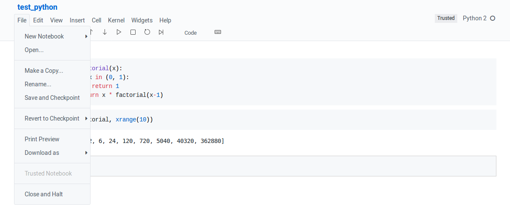

# jupyter-github-theme
Github-inspired theme for Jupyter notebook.

## Installation
  - Install required fonts from `fonts/`
  - Clone or download repository into your Jupyter config folder (`~/.jupyter/custom`)
  
## Screenshots

